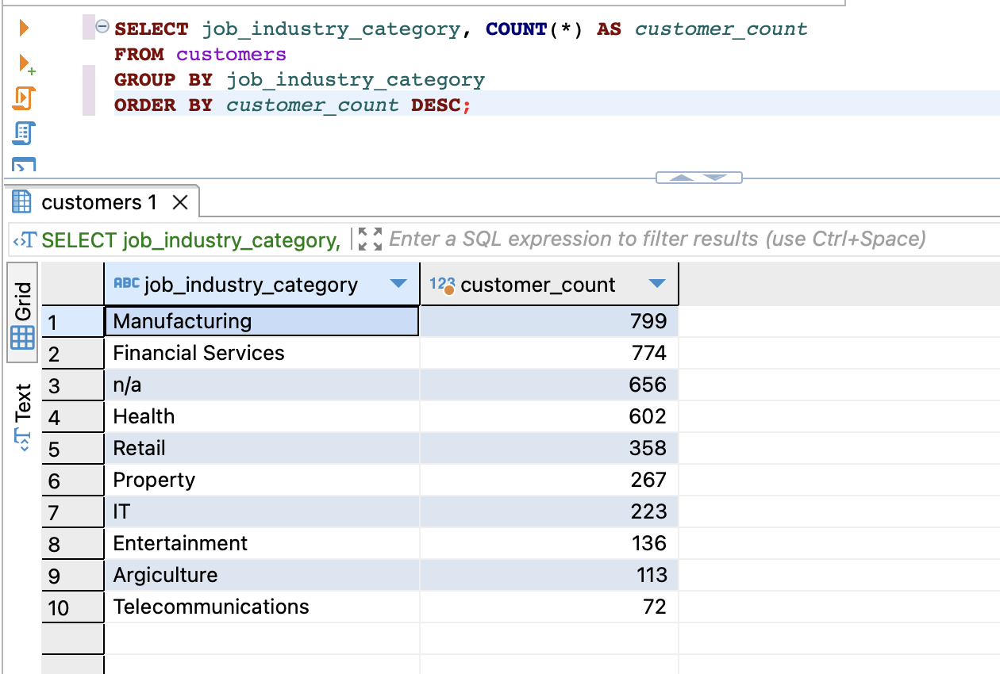

# Задание 3

## 1. Создать таблицы со следующими структурами и загрузить данные из csv-файлов. 

Таблицы были созданы, показаны на скриншоте ниже

## 2. Выполнить запросы

### 2.1 Вывести распределение (количество) клиентов по сферам деятельности, отсортировав результат по убыванию количества. 

### 2.2 Найти сумму транзакций за каждый месяц по сферам деятельности, отсортировав по месяцам и по сфере деятельности. 

### 2.3 Вывести количество онлайн-заказов для всех брендов в рамках подтвержденных заказов клиентов из сферы IT. 

### 2.4 Найти по всем клиентам сумму всех транзакций (list_price), максимум, минимум и количество транзакций, отсортировав результат по убыванию суммы транзакций и количества клиентов. Выполните двумя способами: используя только group by и используя только оконные функции. Сравните результат. 

### 2.5 Найти имена и фамилии клиентов с минимальной/максимальной суммой транзакций за весь период (сумма транзакций не может быть null). Напишите отдельные запросы для минимальной и максимальной суммы

### 2.6 Вывести только самые первые транзакции клиентов. Решить с помощью оконных функций

### 2.7 Вывести имена, фамилии и профессии клиентов, между транзакциями которых был максимальный интервал (интервал вычисляется в днях) 

